<div align="center">
<h1 id="bim小助手-bimhelper" align="center" style="margin: 30px 0 30px; font-weight: bold;">BIM小助手 - BIMHelper</h1>

**一款基于Revit二次开发的建模插件工具集**

[](https://www.autodesk.com/products/revit/)
[](https://dotnet.microsoft.com/)
[](https://docs.microsoft.com/en-us/dotnet/csharp/)

[简介](#一、简介) • [安装](#二、安装与卸载) • [演示](#三、功能演示) • [功能](#四、功能特性介绍) • [技术](#五、技术栈) • [联系](#六、联系方式)

</div>

---

## 一、简介
BIM小助手（BIMHelper）是一个为Revit用户打造的效率提升工具集，包含12个实用功能，覆盖轴网创建、智能标注、视图管理、族库管理等常用场景，使用前端窗口交互的方式，帮助设计人员减少重复性工作，提高工作效率。


<div align="center">
<table>
  <tr>
    <th colspan="6">BIM小助手功能分类总览</th>
  </tr>
  <tr>
    <th>轴网工具</th>
    <th>视图工具</th>
    <th>族管理工具</th>
    <th>尺寸标注工具</th>
    <th>文件保存</th>
    <th>图纸工具</th>
  </tr>
  <tr>
    <td>矩形轴网</td>
    <td>切换背景</td>
    <td>族类型增删改</td>
    <td>两点标注</td>
    <td>自动保存</td>
    <td>门窗大样</td>
  </tr>
  <tr>
    <td>弧形轴网</td>
    <td>设置可见性</td>
    <td>族库管理</td>
    <td>柱子尺寸</td>
    <td></td>
    <td></td>
  </tr>
  <tr>
    <td></td>
    <td>选择全部实例</td>
    <td></td>
    <td>板面标高</td>
    <td></td>
    <td></td>
  </tr>
</table>
</div>


---

## 二、安装与卸载
### 1.系统要求

<table>
  <tr><td><strong>操作系统</strong></td><td>Windows</td></tr>
  <tr><td><strong>Revit版本</strong></td><td>2020</td></tr>
</table>


### 2.安装教程
1. 下载最新版本的 `BIMHelper_v1.0.zip`
2. 解压到电脑本地任意目录，双击 **"BIMHelperInstaller.exe"**。

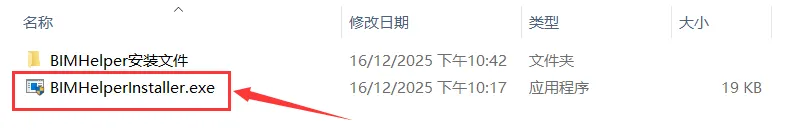

3. 点击安装，


   安装完毕后关闭窗口。


4. 手动检查电脑此目录下是否包含如下文件（本步可略过）：


5. 启动Revit2020，在弹出的窗口选择 **"总是载入"**。

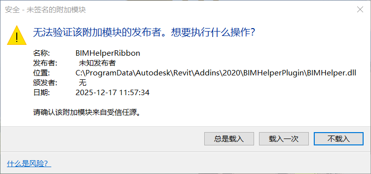

6. 查看功能区是否显示 **"BIM小助手"** 选项卡，如图所示即为安装成功。

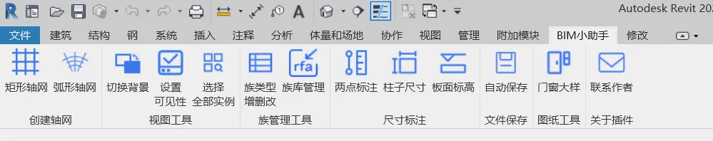

### 3.卸载方法
#### 方法一：永久卸载
双击 **"BIMHelperInstaller.exe"**，点击 **"卸载"** 按钮。


#### 方法二：保留插件但不载入Revit面板
打开以下路径，修改 **“BIMHelper.addain”** 的文件名称和格式名称，如修改为 **“BIMHelper123.addain456”** ，注意文件名称和格式名称均需要修改。  
若需要继续使用插件，重新修改为原名称 **“BIMHelper.addain”** 即可。

```plain
C:\ProgramData\Autodesk\Revit\Addins\2020\
```


---

## 三、功能演示
### 1.演示视频
**视频链接**： [【《BIM小助手》功能操作演示-哔哩哔哩】](https://b23.tv/Gyf4LPi)

### 2.部分功能截图

#### ● 创建轴网

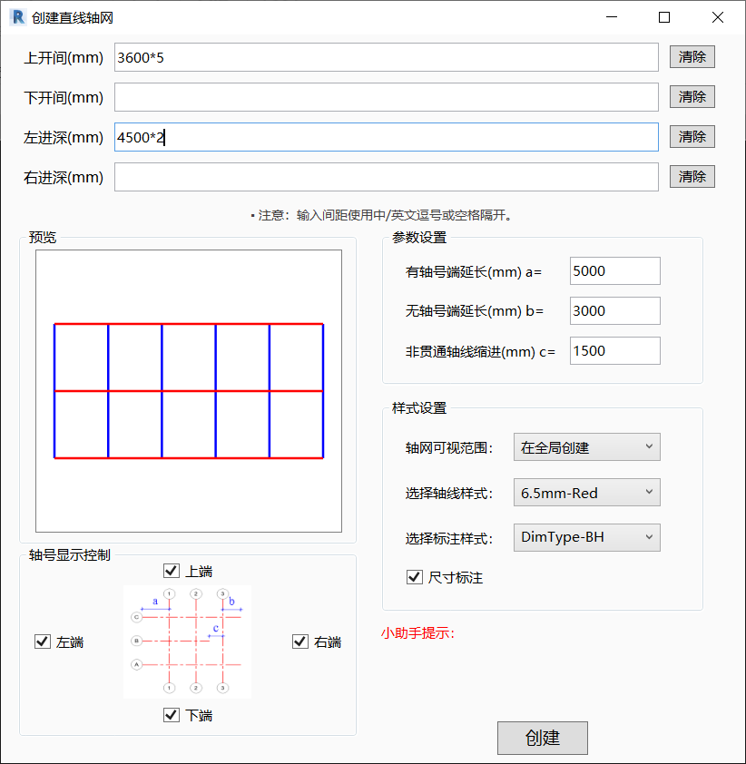


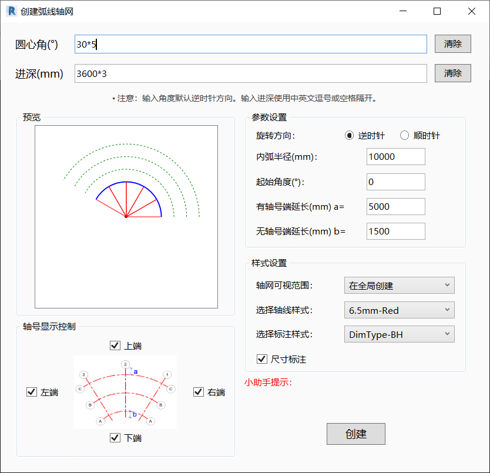

#### ● 设置可见性

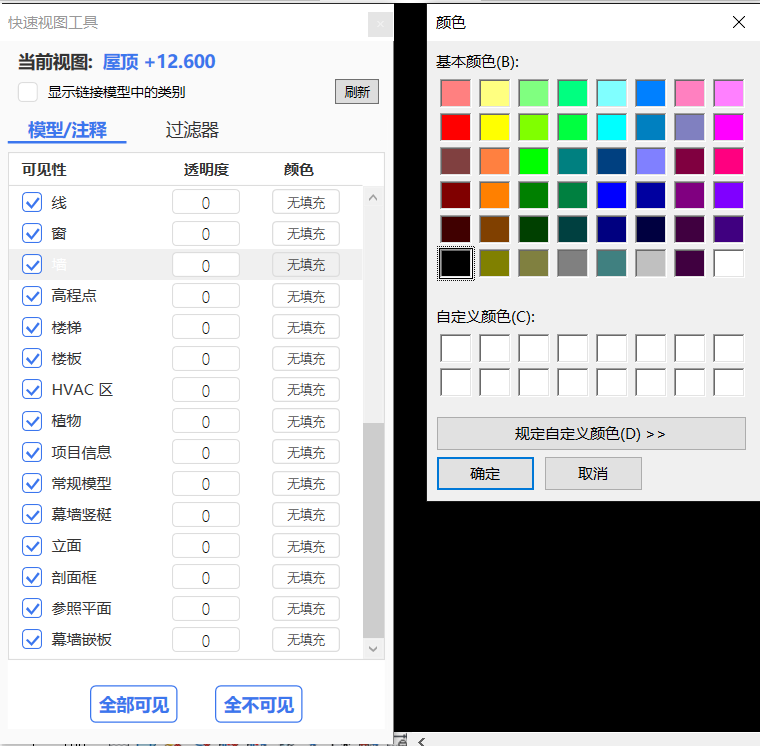

#### ● 选择类似实例


#### ● 族类型增删改

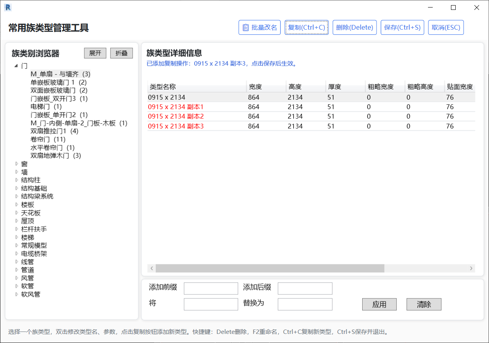

#### ● 族库管理

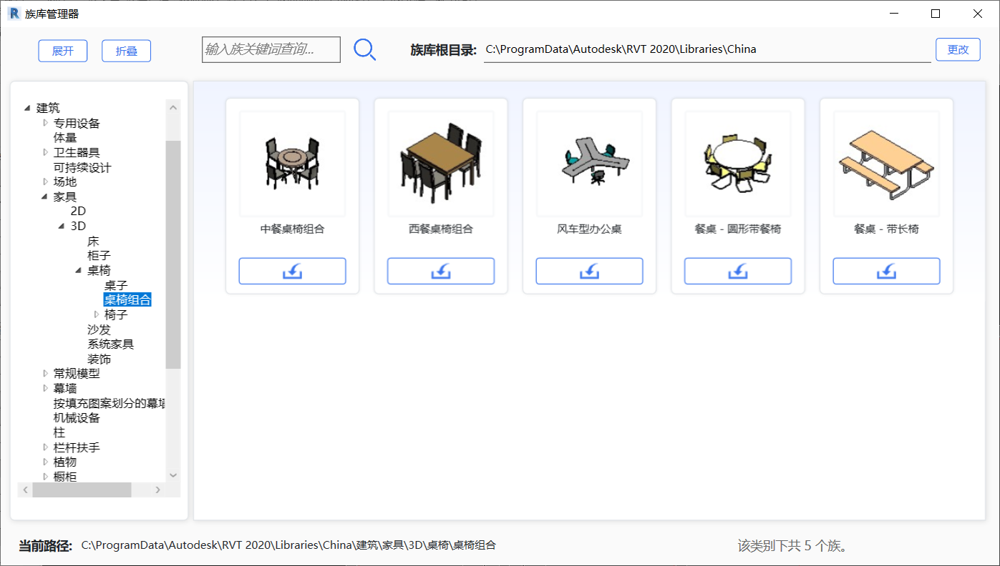

#### ● 柱子尺寸标注

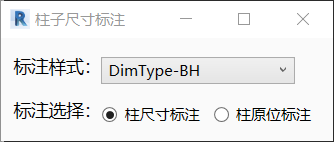

#### ● 板面标高

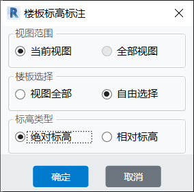

#### ● 自动保存

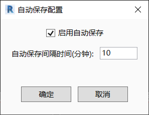

#### ● 门窗大样

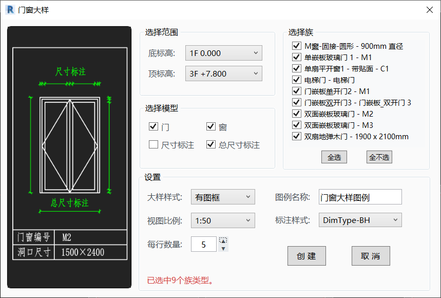


---

## 四、功能特性介绍
### 轴网工具
| 功能 | 说明 |
| --| --|
| **矩形轴网** | 创建正交轴网系统 |
| **弧形架构** | 创建圆弧轴网系统 |


**功能介绍**：

+ 自定义输入轴线间距，如：1000,2000,3000/1000 2000 3000
+ 自动识别输入格式，如：`3*3000` = `3000*3` = 3个3000mm
+ 实时显示轴网预览效果
+ 支持创建尺寸标注
+ 自动生成轴号
+ 输入有误时无弹窗提醒，在窗口界面直接显示错误提醒

---

### 视图工具
| 功能 | 说明 |
| --| --|
| **切换背景** | 点击切换界面背景颜色 |


**功能介绍**：

+ 画布背景色一键切换（白色、灰色、黑色循环切换）
+ 即时生效，无需打开设置页面


| 功能 | 说明 |
| --| --|
| **设置可见性** | 快捷版VV视图工具，批量设置构件的可见性、透明度和颜色 |


**功能介绍**：

+ VV功能的简洁高效版，只显示Revit面板中“图形/可见性”的模型类别、注释类别和过滤器
+ 只显示当前项目已经创建的构件类别，没有创建实例的类别不会显示
+ 可见性、透明度、颜色填充设置后即时生效
+ 可选择是否显示链接模型中的构件类别
+ 切换视图时不会关闭窗口，点击刷新可获取当前视图的构件设置
+ 可见性：可按类别批量控制可见性，可一键设置全部可见或不可见
+ 透明度：可自定义输入透明度（0-100%），或右键一键设置常用透明度数值：30，50，70，重置
+ 颜色填充：修改构件颜色，左键调出颜色选择器，右键一键清除颜色设置

| 功能 | 说明 |
| --| --|
| **选择全部实例** | 选择某个构件在视图中或项目中的所有类似实例，进行批量隐藏或删除 |


**功能介绍**：

+ 选择一个族实例，快速选择所有相同类型的实例
+ 支持当前视图/整个项目范围
+ 批量隐藏，批量删除
+ 实时显示找到同类型构件的数量
+ 连续选择模式，可循环进行选择
+ 应用场景：快速清理模型、检查重复构件、批量操作

---

### 族管理工具
| 功能 | 说明 |
| --| --|
| **族类型增删改** | 批量管理项目中的常用族类型，可添加、删除族类型，修改族类型名、尺寸参数等 |


**功能介绍**：

+ 集中管理项目中的常用族类型，进行批量复制、删除、重命名等操作
+ 目录上方添加一键展开、一键折叠按钮
+ 显示族类别下的族类型数量，显示族类型下的实例数量统计
+ 批量重命名支持添加前缀/后缀，文字替换
+ 使用蓝色文字显示操作提醒
+ 支持快捷键修改，如Delete删除，F2重命名，Ctrl+C复制新类型，Ctrl+S保存并退出，ESC退出程序

| 功能 | 说明 |
| --| --|
| **族库管理** | 浏览Revit系统族库，载入到当前项目中 |


**功能介绍**：

+ 左侧目录按根目录文件夹显示本地族库，右侧显示该类别下的族文件，并显示缩略图
+ 可自行设置族库根目录
+ 添加一键展开、一键折叠按钮，快速展开每级目录
+ 可输入关键词进行搜索并浏览
+ 下方显示当前族的本地路径，当前文件下的族个数
+ 载入族时添加确认载入提示

---

### 尺寸标注工具
| 功能 | 说明 |
| --| --|
| **两点标注** | 三点创建任意方向的尺寸标注 |


**功能介绍**：

+ 第1、2点选择标注位置，第3点选择尺寸标注线的位置
+ 支持对象捕捉（构件端点、中点、交点等）

| 功能 | 说明 |
| --| --|
| **柱子尺寸** | 批量创建结构柱尺寸标注和原位标注 |


**功能介绍**：

+ 批量标注柱子尺寸，框选选择需要尺寸标注的柱子
+ 连续选择模式，可循环进行选择标注
+ 支持普通标注、原位标注
+ 支持多种截面类型柱，如矩形、L形、T形、工字形等
+ 多段标注时自动进行尺寸避让

| 功能 | 说明 |
| --| --|
| **板面标高** | 批量创建楼板的标高 |


**功能介绍**：

+ 批量标注楼板标高，以不同颜色的标注区分平面视图中的升降板
+ 标注完毕后显示成功标注的统计信息
+ 对复杂形状的楼板、多洞口的楼板等，自动选择相对中间位置创建标注

---

### 文件保存
| 功能 | 说明 |
| --| --|
| **自动保存** | 定时自动保存项目 |


**功能介绍**：

+ 定时自动保存项目，可自定义保存间隔时间
+ 开启之后，后台静默运行
+ 每次自动保存时弹出已保存提示及保存的时间

---

### 图纸工具
| 功能 | 说明 |
| --| --|
| **门窗大样** | 自动创建门窗大样图例视图 |


**功能介绍**：

+ 根据选中的底/顶标高范围动态加载族类型
+ 支持过滤门和窗。支持选择多段标注或总尺寸标注
+ 提供常用视图比例进行选择
+ 支持有图框/无图框两种大样样式
+ 可配置每行显示数量
+ 界面UI添加图例视图重名提示

---

## 五、技术栈
```plain
语言：C# 7.0+
框架：.NET Framework 4.7
API：Revit API 2020
UI框架：WPF
```


---

## 六、联系方式
|    <sub>**GitHub**</sub>   [@AmberJohnRay](https://github.com/AmberJohnRay/BIMHelper.git) |    <sub>**Email**</sub>   [825030876@qq.com](mailto:825030876@qq.com) |
| --| --|


---
<div align="center">

### 😃

[⬆ 回到顶部](#bim小助手-bimhelper)

---

**最后更新**：2025年12月  
**版本**：v1.0.0

</div>
